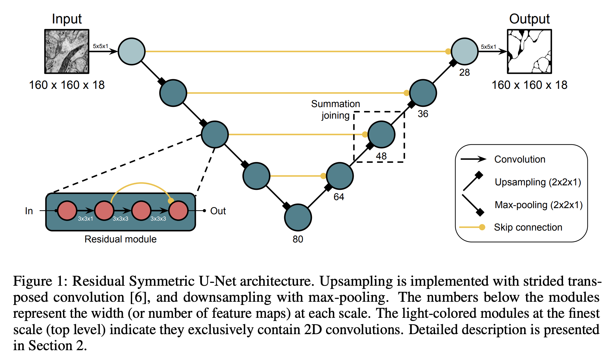
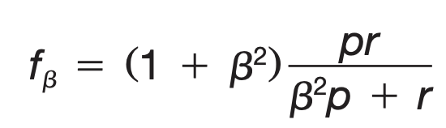

# Abstract 
This project is Zhaohong Jin's research project at [Harvard's Visual Computing Group](https://vcg.seas.harvard.edu/) Lab supervised by [Professor Hanspeter Pfister](https://vcg.seas.harvard.edu/people) and [Donglai Wei, PhD](https://donglaiw.github.io/). It is primarily concerned with studying how to re-construct 3D shaped neurons from Electron Microscope(EM) or Computed Tomography(CT) scanned images of brain tissues. Traditionally, this is done through semantic analysis where deep learning approaches(such as 3D U-Net) predicts which class each pixel of the image belongs to. EM generated images have better qualities at the cost of time and computation power (EM only looks at a small region of the brain). CT based approaches are more scalable at the cost of low image quality. In this project, we are exploring a way to re-construct 3D shapd neurons from low quality CT images by combining semantic segmentation with a global prior on the neuron shape to fix prediction errors. This means large 3D re-construction at scale is possible.

# Background and Problem Statement
Currently the most popular way of doing volumetric segmentation on Biomedical images is through variants of [3D U-Net](https://arxiv.org/abs/1606.06650). Taking a cubic volume of the brain which has shape (x, y, z), 3D U-Net looks at each 2-D slices with sparsely annotated labels during training, and it is able to generalize to unlabelled part. The state of the art 3D U-Net is developed by [Lee et.al](https://arxiv.org/abs/1706.00120), which achieves superhuman accuracy on the SNEMI3D Connectomics Challenge (we call it Superhuman U-Net). Leveraging this model, we will apply it to segment the cubic volume into blood vessels and cells (including the cell body and dendrite). The volume we get is from CT images. This means the image is not high quality, and Superhuman U-Net will make some wrong predictions which cause our reconstruction to go wrong. The solution we propose is to construct a global prior of cells such that we can combine the segmentation and the global prior to correct the reconstructed models. For the global prior, the initial solution is to predict a set of anchor points and build a spline representation of the cell body and dendrite (this goal might be updated in the future upon further study). 

# Algorithm / Model Introduction

  

# Experiments 

## Dayer et.al Dataset

We test the accuracy of Superhuman U-Net on the work of Dayer et.al[http://www.eneuro.org/content/eneuro/4/5/ENEURO.0195-17.2017.full.pdf]. In this paper, they produced three datasets using synchrotron X-ray microtomography (uCT): V1 (195, 195, 65 um) and V2 (130, 130, 65 um) and test volume V3 (130, 130, 130 um). For V1 and V2, the labels are densely labelled with blood vessels and cell bodies. V3 is sparsely labelled. We run our Superhuman U-Net on this volume and our output has three channels(background, blood vessel, and cell bodies). To be comparable with the results in the paper, we only look at the channel for cell bodies. We then threshold the probabilities in the channel to determine which pixel belongs cell body. To evaluate the result, we use the precision and recall. First, threshold is treated as a hyperparameter to balance the precision and recall. Dayer's paper uses f1 and f2 score, defined as 

  

where beta takes value of 1 or 2. For pixel level segmentation, f2 score produces more accurate result as claimed in the paper. Therefore, we also reproduce the f2 score. To trace the predicted cell body, we use a simply connected component algorithm to find all connected points and then compute a centroid. As a suggested threshold from the paper, if the centroid of the predicted cell is within 10um of a label, then we identify them as a match and remove them both from the dataset. The following table summarize our results. 

|    | V1(precision, recall) | V2(precision, recall) | V3(precision, recall) |
|:---|:---|:---|:---|
| Dayer |  0.86, 0.84 |  0.83, 0.76  |  0.94, 0.78 |
| Superhuman UNet |  0.81, 0.68 | 0.67, 0.83   | 0.78, 0.88 |

To reduce inbalance in label weights, we have to apply a weight factor alpha on the labels. For V2 result, we set alpha=5, and for V1 and V3 result, we set alpha=20

One of the drawback of Dayer's paper is decision tree is used to classify the cells and blood vessels. This is a weak algorithm and doesn't produce accurate results. The test dataset (V3) is sparsely labelled and therefore, the precision and recall score calculated doesn’t accurately reflect the how well the decision tree algorithm performs. For example, a week prediction algorithm only predicts cells that are easily identifiable, and these cells happen to be those being sparsely labelled. This will achieve a high precision score, but it’s not a good benchmark. The Superhuman UNet achieves a higher recall score on both V2 and V3, which means it correctly identifies more correct cells compared to the decision tree algorithm while also finds cells not labelled in the dataset.
 

## Mouse(ZeissNag) Dataset

Compared to Dayer's dataset, mouse dataset has low resolution but comes in larger volume. Achieving good results on this dataset means we can have a prediction pipeline that is more scalable because image quality has been a limiting factor. We train the Superhuman UNet in two different ways on the mouse dataset. First, we train only with the mouse dataset. Second, we train with both Dayer's dataset and the mouse dataset. We plan to use the same evaluation metrics such as f2 score. We are still in the process of fine tuning the parameters.

# Instructions

# Conclusion
